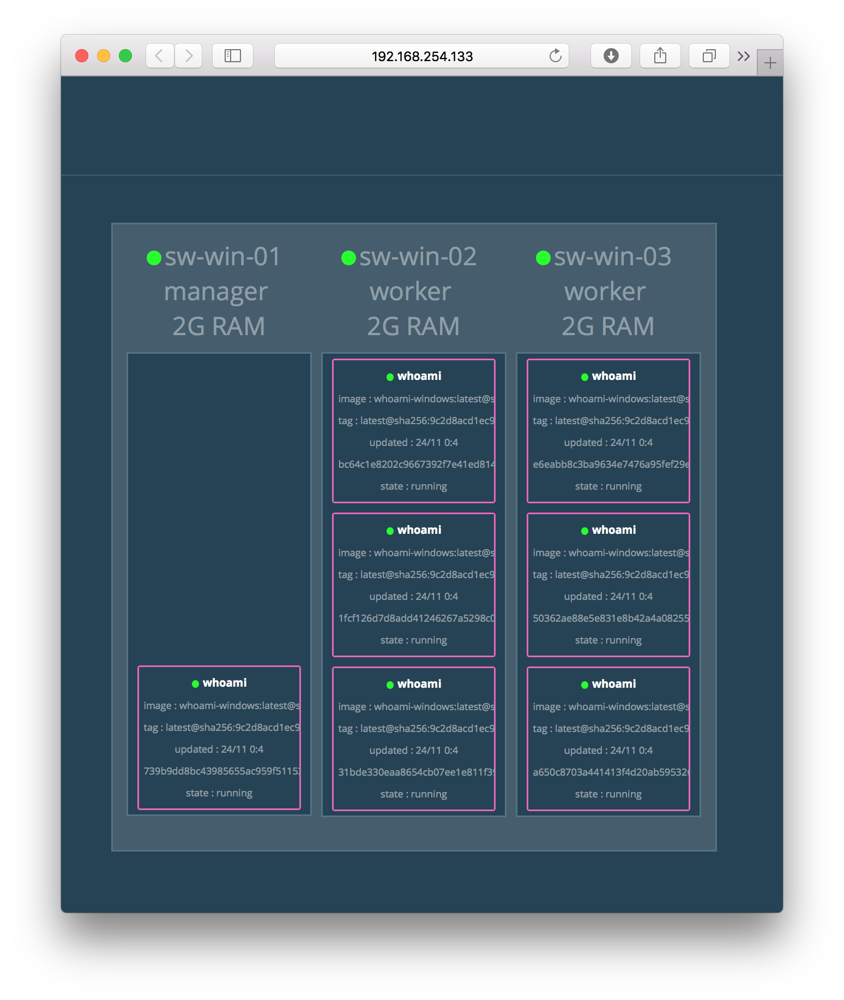
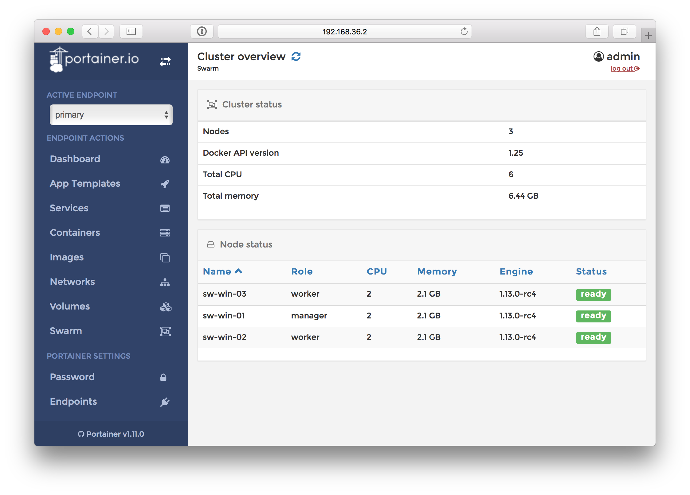

# Windows 10 Docker swarm-mode

## This is a work-in-progress branch for Hyper-V support

- [ ] Update `windows_10_insider.json` at [StefanScherer/packer-windows](https://github.com/StefanScherer/packer-windows) for hyperv-iso builder
 - Partially done
 - There is a new keyboard layout / locale prompt that isn't handled by autounattend.xml yet. If you click through it then the Packer build completes normally
- [ ] Fix vm names. They show up as `packer-hyperv-iso` ... 
- [ ] Enable nested virtualization? Required for Hyper-V containers 
 - Waiting on https://github.com/mitchellh/vagrant/pull/8325
- [ ] Fix reboot after role installation `config.vm.provision "reload"`
- [ ] Static ip support in Hyper-V provider
 - This is in progress but needs to go into a PR to Vagrant


This is a local setup using Vagrant with VMware Fusion to demonstrate a Windows 10 Insider Docker swarm-mode.

This repo is tested with Vagrant 1.9.2 and VMware Fusion Pro 8.5.3. VirtualBox does not work as it doesn't support nested virtualization.

## Get the base box

First download the latest [Windows 10 Insider 15042 ISO](https://www.microsoft.com/en-us/software-download/windowsinsiderpreviewadvanced), but you need to be registered to the Windows Insider program.

For the next step you need [Packer](https://packer.io). You have several ways how to install it. The easiest way is to install it via [Homebrew](http://brew.sh/). After you have installed Homebrew. Run the following command when you installed Homebrew:
```bash
brew install packer
```
If you don't have the Vagrant `windows_10_15042` base box you need to create it first with [Packer](https://packer.io). See my [packer-windows](https://github.com/StefanScherer/packer-windows) repo to build the base box.

To build the base box you have to run these commands on your host machine:

```
git clone https://github.com/StefanScherer/packer-windows
cd packer-windows
packer build --only=vmware-iso --var iso_url=~/Downloads/Windows10_InsiderPreview_EnterpriseVL_x64_en-us_15042.iso windows_10_insider.json
vagrant box add windows_10_15042 windows_10_insider_vmware.box
```
>>>>>>> master

## Vagrant boxes

This setup uses the `windows_10_insider` box from [StefanScherer/packer-windows](https://github.com/StefanScherer/packer-windows). Be sure to name the box to match the `Vagrantfile` as you load it. For example: `vagrant box add --name windows_10_15042 .\windows_10_insider_hyperv.box`


There are three VM's with the following internal network and IP addresses:

| VM        | IP address   | Memory |
|-----------|--------------|--------|
| sw-win-01 | 192.168.36.2 | 3GB    |
| sw-win-02 | 192.168.36.3 | 3GB    |
| sw-win-03 | 192.168.36.4 | 3GB    |

Depending on your host's memory you can spin up one or more Windows 10 VM's.

## Swarm Manager

The `sw-win-01` is the Swarm manager.

## Swarm worker

The `sw-win-02` and `sw-win-03` are Swarm workers.


## Demo

Have a look at the folder [`demo`](https://github.com/StefanScherer/windows10-docker-swarm/tree/master/demo) with some helper scripts to create a overlay network, a scaled service and a consumer trying to fetch data from this service using the overlay network.

## Example usage

Open a PowerShell window in the `sw-win-01` machine and create a service

```
PS C:\> docker service create --name=whoami stefanscherer/whoami-windows:latest
```

Check the service

```
PS C:\> docker service ls
ID            NAME    MODE        REPLICAS  IMAGE
eptkxbn1gce5  whoami  replicated  1/1       stefanscherer/whoami-windows:latest
```

Then scale up the service

```
PS C:\> docker service scale whoami=10
whoami scaled to 10
PS C:\> docker service ls
ID            NAME    MODE        REPLICAS  IMAGE
eptkxbn1gce5  whoami  replicated  6/10      stefanscherer/whoami-windows:latest
PS C:\> docker service ls
ID            NAME    MODE        REPLICAS  IMAGE
eptkxbn1gce5  whoami  replicated  6/10      stefanscherer/whoami-windows:latest
PS C:\> docker service ls
ID            NAME    MODE        REPLICAS  IMAGE
eptkxbn1gce5  whoami  replicated  10/10     stefanscherer/whoami-windows:latest
```

## Visualizer

Open a PowerShell window on the `sw-win-01` machine and run the script

```
C:\vagrant\scripts\run-visualizer.ps1
```

Now open a browser to see the visualizer UI. I use the IP address of the manager VM and open a browser on my host machine.



## Portainer

Open a PowerShell window on the `sw-win-01` machine and run the script

```
C:\vagrant\scripts\run-portainer.ps1
```

Now open a browser to see the Portainer UI. Portainer is started as a Docker service. At the
moment you can't use `--publish` on Windows. So we have to pick the IP address of the container
to open it in a browser. Run the helper script

```
C:\vagrant\scripts\open-portainer-ui.ps1
```



With both Visualizer and Portainer you could demonstrate scaling services


